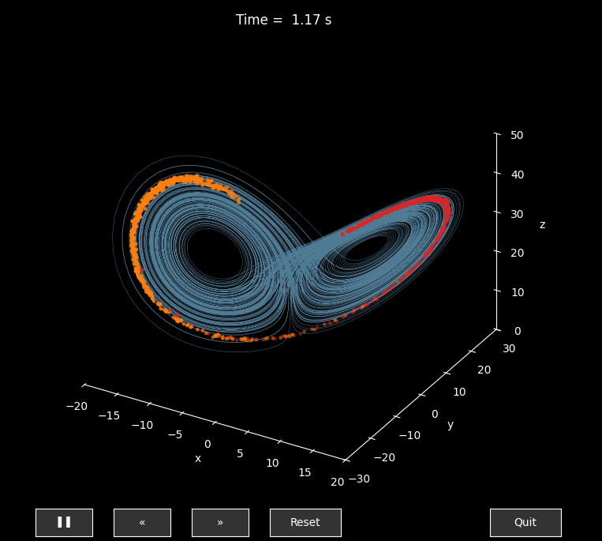
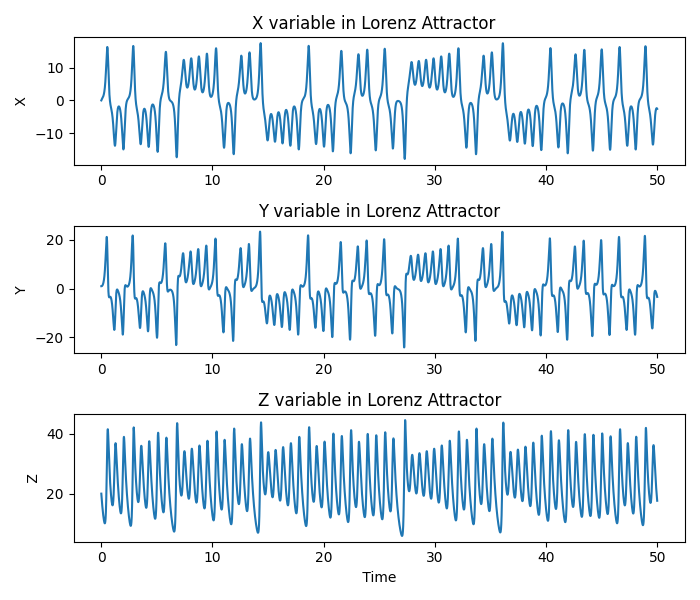
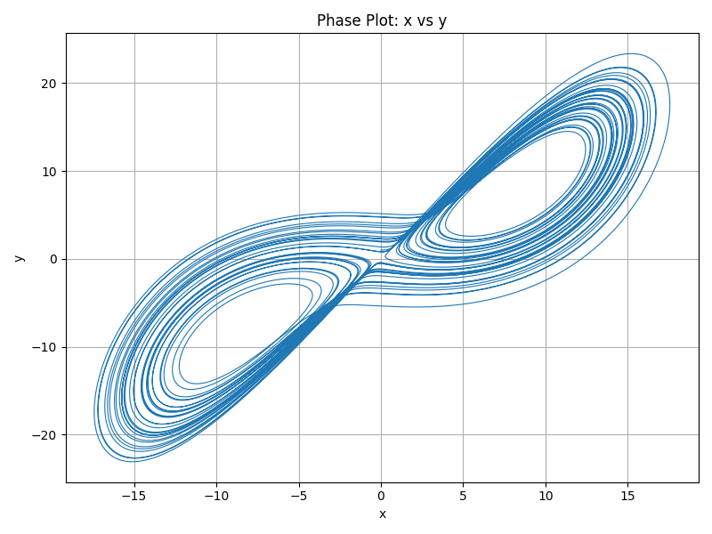
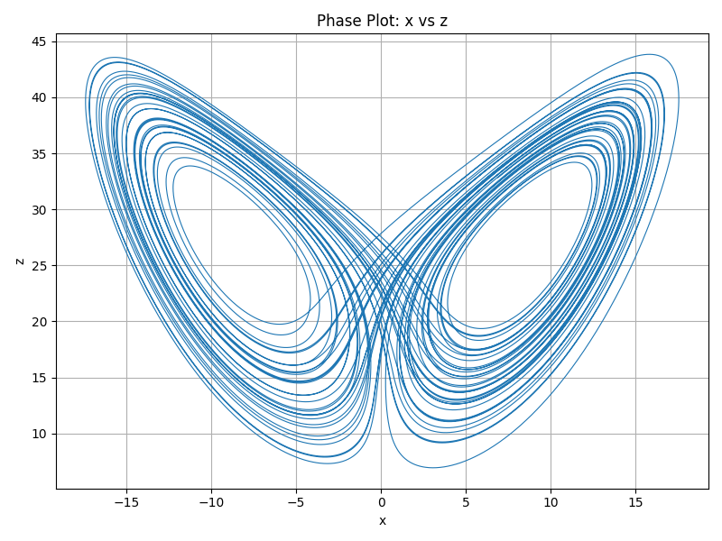

# Deep Lorenz

Deep Lorenz is a simple python package (it is at very primitive level now) that predicts some chaotic properties of the Lorenz system. It solves differential equations of  the system with given parameters and initial values of the system variables. After obtained the solution, the user can  produce several different 3d and 2d phase space plots of the lorenz system. The package gives the user freedom to change the system parameters, the time interval of the system and initial values of system variables (x, y, z) without running again the package creating `LorenzClass` object. Ultimate goal of  this package to predict chaotic properties and reconstruct the chaotic system using deep learning and machine learning methods.


## Features

- Solves the lorenz system equations.
- Plots 3d phase space (x, y, z) and one dimentional subsystem 2d (x, t), (y, t), (z, t).
- Saves the data obtained and load the saved data from  a file (not yet ready).
- 3d Animation of the Lorenz system with particle flows on the lorenz system orbits.
- Saves the animation as 'mp4' formatted file

## Images





## Installation

You can install the package from **source** and also you can use directly from source folder by importing. 


### Install from Source (GitHub)

```bash
git clone https://github.com/oguzhankasikci/deeplorenz.git
cd deeplorenz
pip install .
```

## Dependencies
- numpy>=1.21,<2.0.
- scipy>=1.7.
- matplotlib>=3.7.
  
## Usage

You can use `deeplorenz` to obtain 3d or 2d plots of the lorenz system after installation.

### Example: 

```python
from deeplorenz import LorenzClass

# Initialize the class
lc = LorenzClass()
lc.solve()          # integrates with defaults
lc.plot_2d()        # 2‑D component plot
lc.plot_3d()        # 3‑D trajectory
lc.plot2dcomp('x')             
    

# Change initial conditions and resolve
lc.set_initial_value(X0=(5.0, 5.0, 5.0))
lc.set_parameters(params= (5.0, 6.0 / 3.0, 12.0),)
lc.set_time_grid(0, 30, n_steps=30_000)              
lc.plot_2d()    
lc.plot_3d()
lc.plot2dcomp('x') 

# Animation: in animlorenz.py file you can change all parameters used  to create animation.

# 1.  Simulation parameters
# ##########################################
SIGMA, BETA, RHO = 10.0, 8.0 / 3.0, 28.0     # lorenz system parameters
DT,  N_STEPS   = 0.009, 10_000               # For particles time difference and  number of steps 
ATTR_DT, ATTR_STEPS = 0.01, 20_000           # For Attractor time difference and number of steps
ATTR_INITIAL = [-8., 8., 20.]                # Attractor initial point
DRAW_EVERY     = 5                           # animation stride
N_PART         = 500                         # particles per colour
XLIM, YLIM, ZLIM = (-20, 20), (-30, 30), (0, 50). 
SAVE = 'yes'
```
